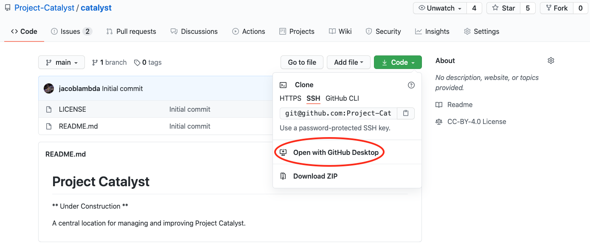

# Project Catalyst

** Under Construction **

A central location for managing and improving Project Catalyst.

This site is built using [Vuepress](https://vuepress.vuejs.org/)

## How to start contributing

### You will need:

* node & npm - [Installation Guide covering most platforms](https://nodejs.org/en/download/package-manager/)
* markdown editor - Suggestions are welcome. I am using [VSCode](https://code.visualstudio.com/)
* git - Easiest client to use is [Github Desktop](https://desktop.github.com/)
* Basic knowledge of Markdown [Guide](https://www.markdownguide.org/basic-syntax/)

### How to start:

* Install node
* Create a github account and install [GitHub Desktop](https://desktop.github.com/)
* Download site code. Go to [repository](https://github.com/Project-Catalyst/catalyst) and *Download with GitHub Desktop*

* You can start editing *docs/src* right away using your favourite Markdown editor
* If you want to see effects of your work as you go:
  * Go to *project folder*/docs in any terminal and run `npm install` to install all the necessary dependencies
  * Run `npm run dev` and go to [http://localhost:8080/](http://localhost:8080/) in your favourite browser to see results of your work immediately

* To build a complete static site run `npm run build`, the result is generated in *static* in the main project directory

### Github Actions

There is a simple node.js action configured in `.github/workflows/node.js.yml` which will build the static site every time new content is pushed to the site.