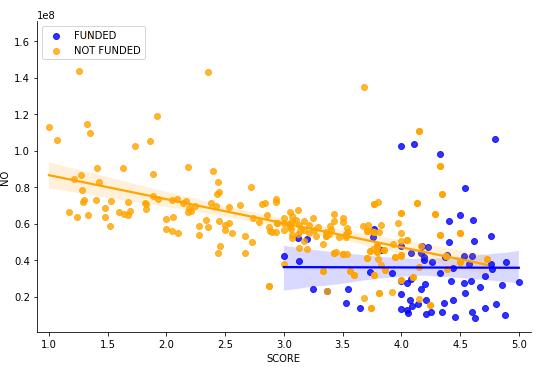
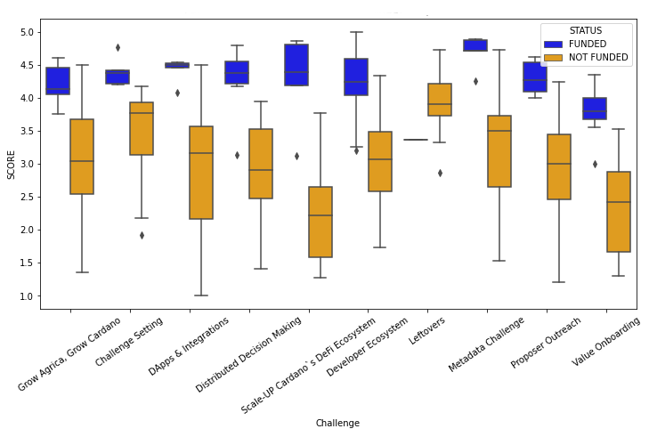
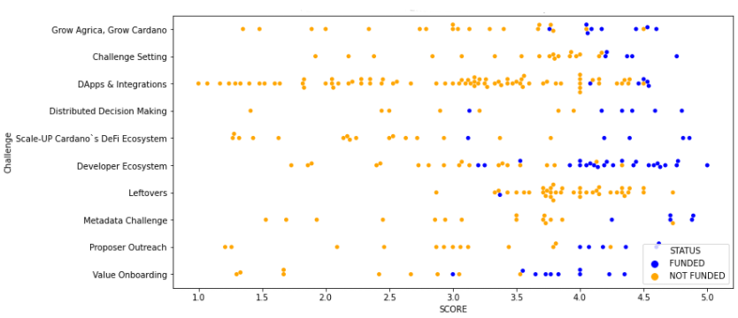

# Statistics - Fund 6 

[Consolidated File](https://docs.google.com/spreadsheets/d/1hEUq2mCEYUk-oWaU-dFESu0lyo5zRR2HL7M7O8aURes/edit#gid=1652451874)


- Aggregated: This data contains all the non-blank assessments made by CAs for Fund 6. 
For each assessment it is possible to see all the basic information (ratings, rationale, assessor, proposal, etc.) and also the ""Proposer rationale"" (if any) and the result of the classification made by Veteran Community Advisors (Excellent, Good, Not Valid).
You can use the ""filters"" on the column headings to search for proposals, assessors, etc.
- Valid Assessments: This tab contains all the valid assessments (classified as Excellent or Good by vCAs) for Fund6.
These assessments are used to calculate the final rating for proposals and rewards for CAs.
You can use the ""filters"" on the column headings to search for proposals, assessors, etc.
- Proposal scores: This tab contains the list of all the proposals that will be part of the voting stage.
For each proposal it is possible to see the Rating Given (obtained with the average of all related valid assessments) and the number of the assessments that make up the final score.
- Excluded Assessments: This tab contains all the assessments that were excluded during the process. It includes "blanks" assessments (assessments blanks or incomplete) and assessments "Filtered Out" by vCA in the Assess-QA stage.
- Veteran Community Advisors: This tab contains the list of all the Veteran Community Advisors whoo took part in the assess-QA stage.
Each vCA is listed with his/her name, the link to the Googel Sheet with his/her reviews, and the total number of reviews made (this number will be used to calulate vCA rewards)."
- vCA Aggregated: This tab contains all the non-blank assessments and it was used to calculate the consesus between vCAs.
For each assessment, in addition to general information, there is the total count of vCA who voted for ""Excellent"", ""Good"" or ""Not valid"", and the final result.
The algorithm used for the consensus calulcation is the following (based on the guidelines):

```
    if n_excellent > n_total/2:
        assessment is excellent
    elif n_filtered_out >= n_total/2:
        assessment is filtered_out
    else:
        assessment is good"
```
# Fund 5 : Voting Statistics
## Down Votes Vs Overall Score

## Funded and Not Funded Proposals Score

## Funded and Not Funded Proposals Score
